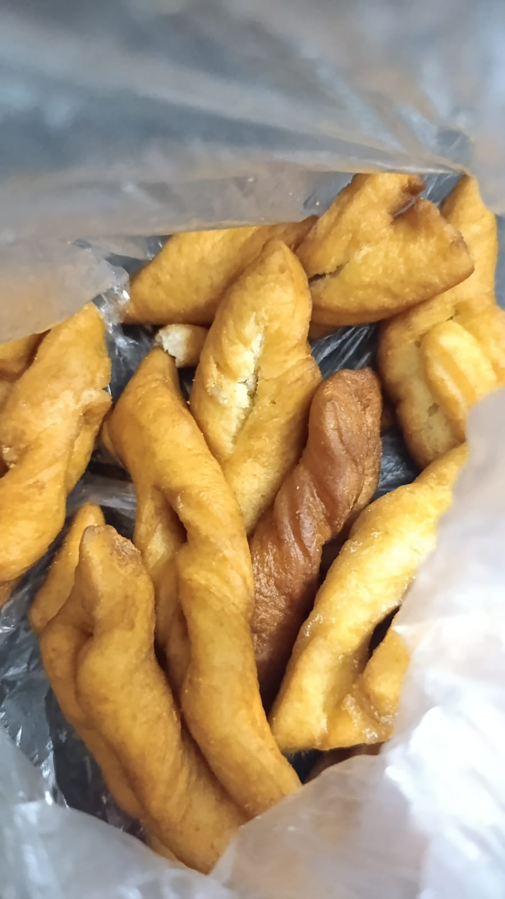

# 👩🏽‍🍳 RECEITA DE MENTIRA DOCE OU CUECA VIRADA

### Curiosidades

| ***Simplicidade Enganosa:*** |***Formato Curioso:***|
|------------------------------|----------------------|
|*A receita é tão simples que leva apenas alguns ingredientes, mas tem um sabor tão rico que pode parecer que há mais componentes nela.* |*Criado ao trançar a massa antes de fritar, lembra uma peça de roupa íntima masculina que foi torcida e virada.*|

---

## 🧈 INGREDIENTES 
**50 porções**

- 1 kg de trigo
- 150g de margarina
- 4 ovos
- 1 pitada de sal
- 300g de açucar
- 1 e 1/2 xícara de leite
- 1 e 1/2 colher de sopa de fermento

## 🥣 MODO DE PREPARO
🕰 Estimativa: 1 hora

1. Misture todos os ingredientesem uma tigela. Coloque o trigo aos poucos. Derrube a massa em um tampo e sove-a.

2. Molde os biscoitos e frite em óleo quente. Passe no açúcar com calena para finalizar.

<mark>Obs: Para que as mentiras fiquem crocantes, abra a massa com um rolo, quanto mais fina e feitas em formatos menores mais crocante ela fica.

---

Não se prenda a uma só "receita", segue um vídeo para acompanhar com ingredientes e modo de preparo diferente, mas com o mesmo resultado:
[![QUANDO FAÇO ISSO NÃO SOBRA NADA! O SABOR É SURPREENDENTE! FÁCIL - RÁPIDO -ECONÔMICO!-Isamara Amâncio]](https://www.youtube.com/watch?v=video-id, "QUANDO FAÇO ISSO NÃO SOBRA NADA! O SABOR É SURPREENDENTE! FÁCIL - RÁPIDO -ECONÔMICO!-Isamara Amâncio")

 > *O que vale é tentar* 😘 (TESCH, 2025)

 **Obrigado e até mais!!** 😊

